## Fitxer README.md de la segona pràctica d'Angel Ivanov

# M13 - Exercici pràctic FastAPI: L’API d’alumnes

# Apartat 1: Crida de l’API des de la web

_Imatge de la visualizatció de les dades al navegador_

.
.

_Imatge de la visualizatció del select-join a la bbdd_
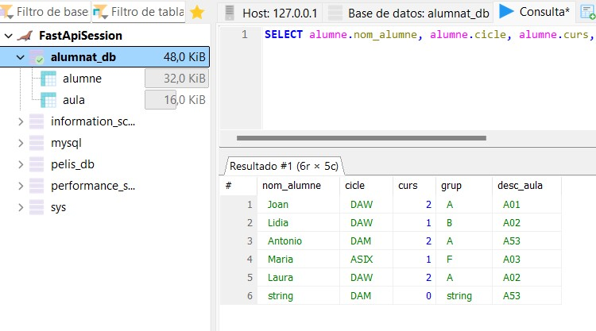

.
.

_Imatge de l'execució de la query amb el Swagger_
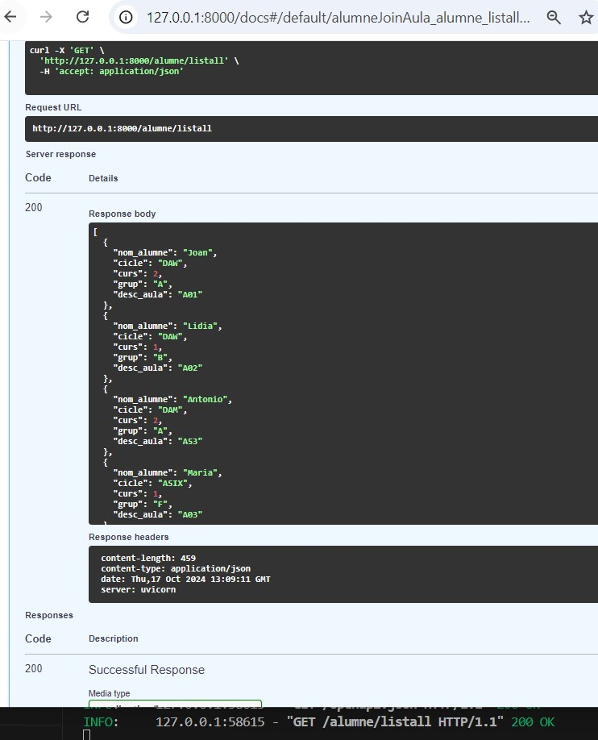

.
.

# Apartat 2: Consultes avançades

+ _order by_
_Imatge de l'execució en el swagger de la query select amb ORDER BY ASC_

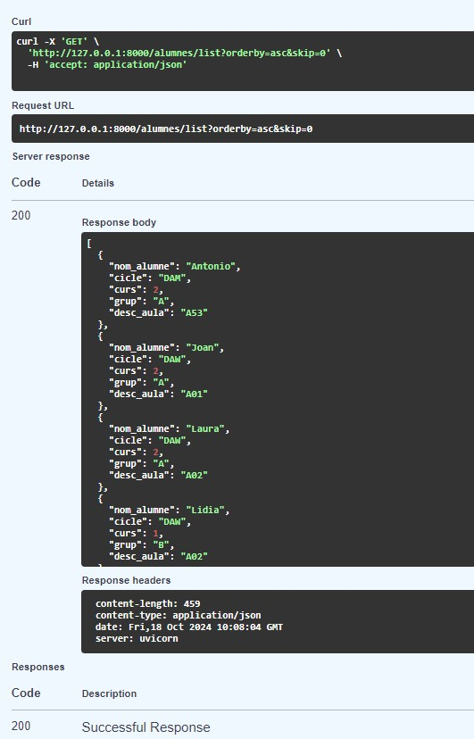

.
.

_Imatge de l'execució en el swagger de la query select amb ORDER BY DESC_

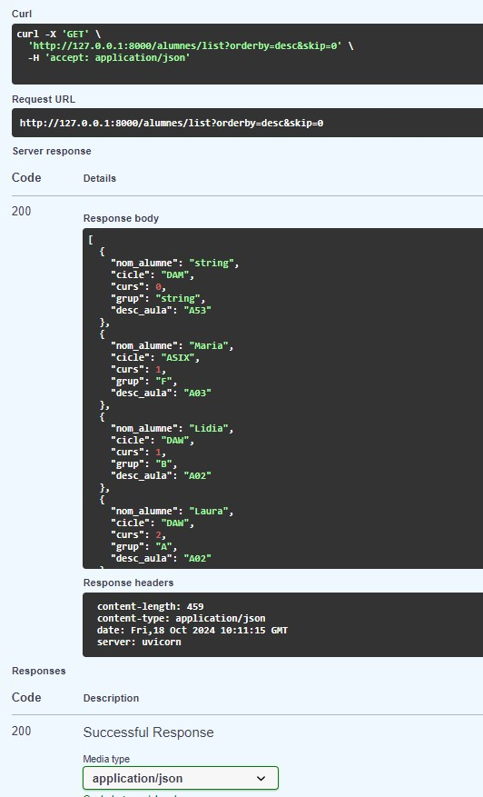

.
.

+ _contain_
_Imatge de l'execució en el swagger de la query select amb CONTAIN_

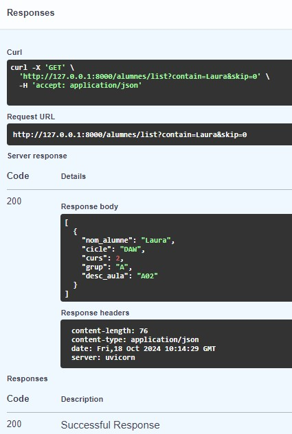

.
.

+ _skip & limit_
_Imatge de l'execució en el navegador i a Heidi de la query select amb SKIM & LIMIT_

.
.

_Imatge de l'execució en el swagger de la query amb SKIM & LIMIT_

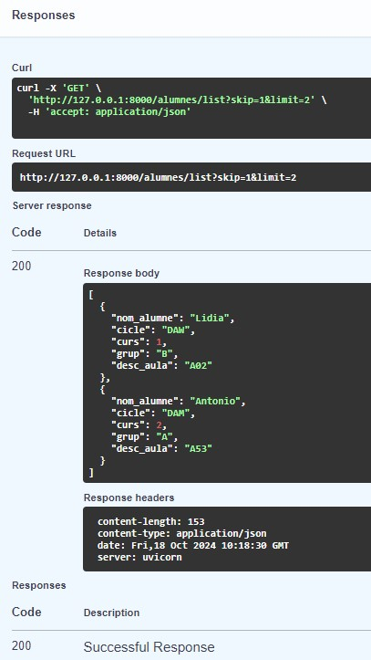

.
.

# Apartat 3: Càrrega massiva d’alumnes

_Imatge de l'execució de la primera part del codi: insert de camps a la taula Aula_

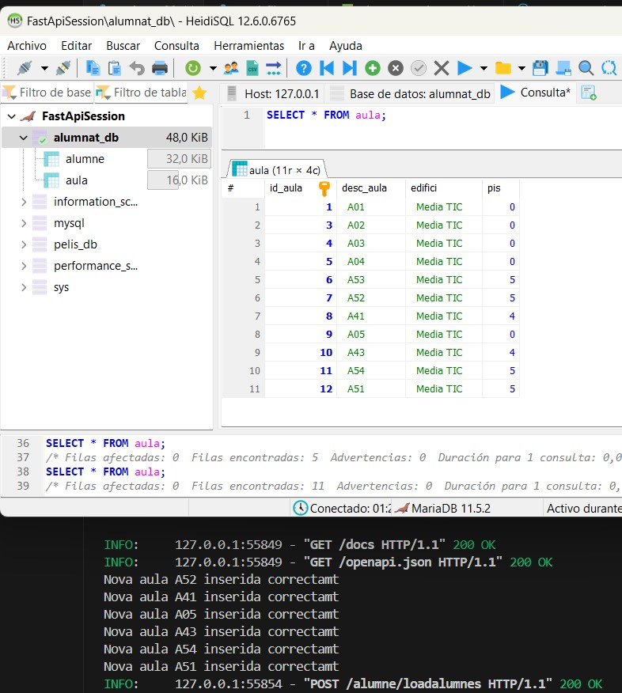

.
.

_Imatge de la taula aula abans del insert de dades des d'un fitxer csv_

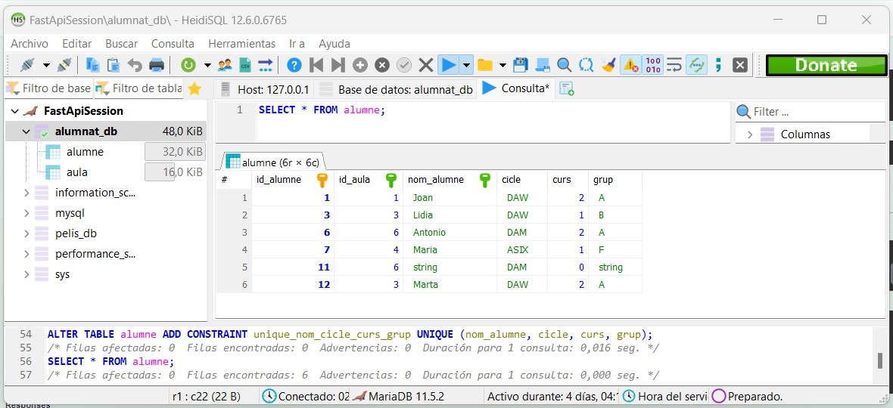

.
.

_Imatge de l'execució del mètode post en el swagger_

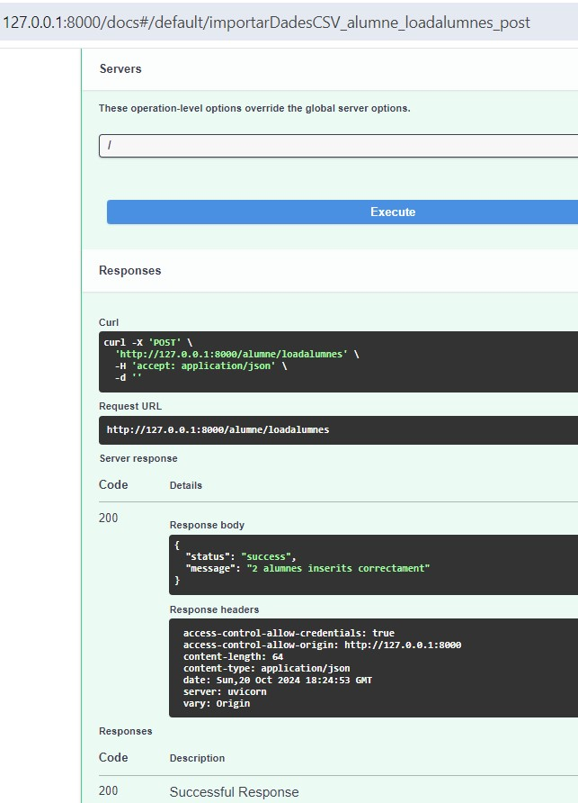

.
.

_Imatge de l'execució del mètode post i del resultat en la consola_

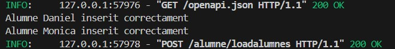

.
.

_Imatge després d'un nou insert des d'un fitxer csv i el resultat a la taula alumne i el swagger_

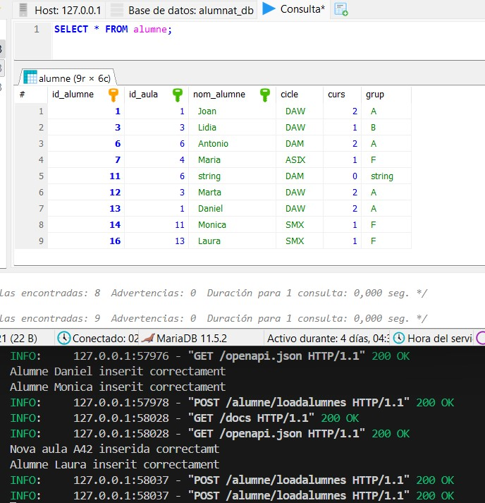

.
.

_Imatge després d'un nou insert des d'un fitxer csv i el resultat a la taula aula i del resultat en la consola. En el primer insert de dos alumnes, Daniel és inserit sense problemes, però en el segon insert tornem ha intentar l'insert de Daniel i una altra alumna(Laura). La segona alumna s'ha inserit correctament i Daniel no per la restricció (UNIQUE) definida a la taula alumne/bbdd_

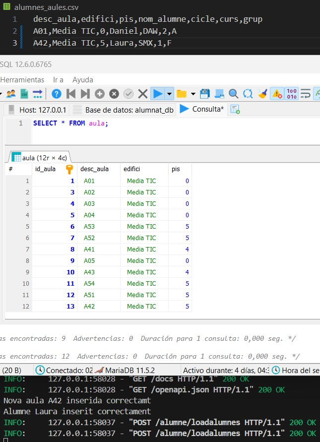

------------------------Leyenda MarkDown------------------- lista no numerada: +/*/- Elemento 1 encabezado: ### Titulo 1 negrita: /texto en negrita/ cursiva: /texto cursiva/ enlace: Visita Google imagen desde archivo: 