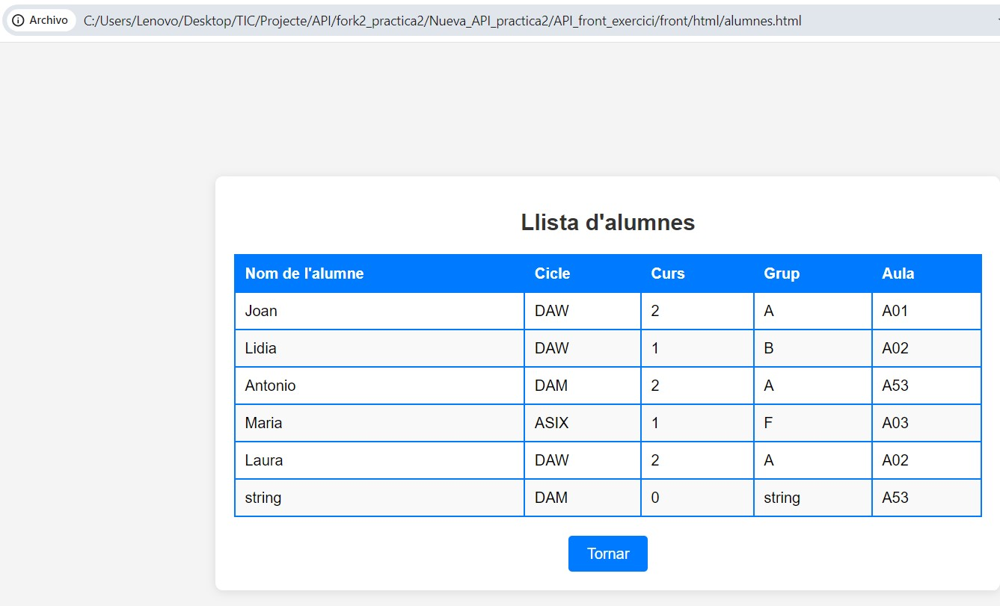
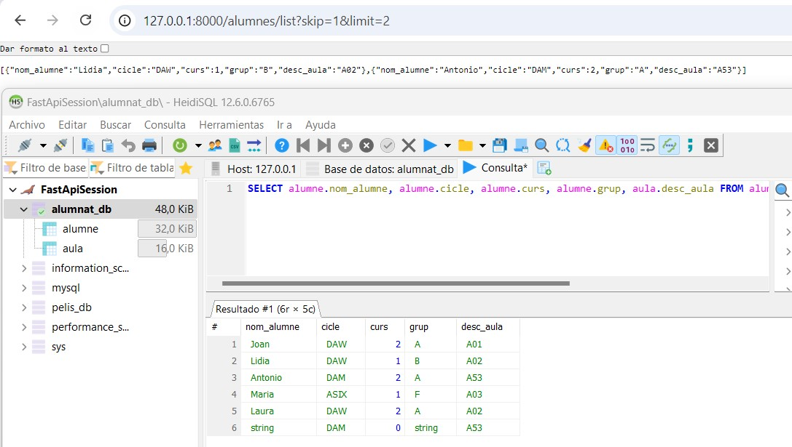

## Fitxer README.md de la segona pràctica d'Angel Ivanov

# M13 - Exercici pràctic FastAPI: L’API d’alumnes

# Apartat 1: Crida de l’API des de la web

_Imatge de la visualizatció de les dades al navegador_

_Imatge de la visualizatció del select-join a la bbdd_

_Imatge de l'execució de la query amb el Swagger_

# Apartat 2: Consultes avançades

+ _order by_
_Imatge de l'execució en el swagger de la query select amb ORDER BY ASC_

_Imatge de l'execució en el swagger de la query select amb ORDER BY DESC_

+ _contain_
_Imatge de l'execució en el swagger de la query select amb CONTAIN_

+ _skip & limit_
_Imatge de l'execució en el navegador i a Heidi de la query select amb SKIM & LIMIT_

_Imatge de l'execució en el swagger de la query amb SKIM & LIMIT_

# Apartat 3:

------------------------Leyenda MarkDown------------------- lista no numerada: +/*/- Elemento 1 encabezado: ### Titulo 1 negrita: /texto en negrita/ cursiva: /texto cursiva/ enlace: Visita Google imagen desde archivo: 